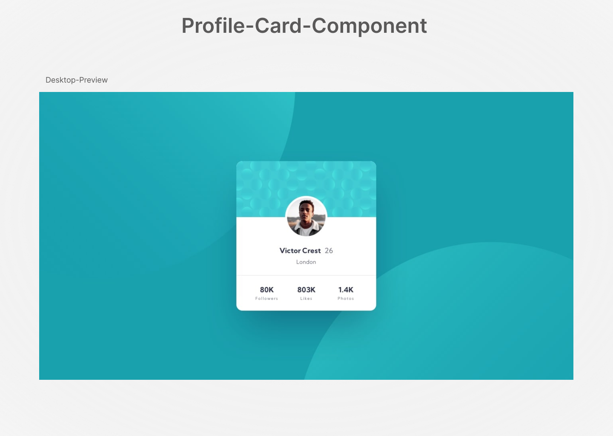

# Profile-Card-Component (flexbox)
   

## Hey there 👋, thanks for visiting.
  It contains my solution to "Frontend Mentor's" challenge which you can try [here](https://www.frontendmentor.io/challenges/profile-card-component-cfArpWshJ).
  You need basic understanding of HTML,CSS and/or JS.

## Learnings
* Placing different items together to make one card
* Placing background images (pattterns).

